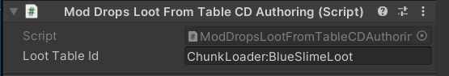

# Loot Drop Tables Module
Loot Drop Tables Module is a submodule that allows to add, modify and remove loot drops.

## Usage example:
Make sure to add `[CoreLibSubmoduleDependency(nameof(DropTablesModule))]` to your plugin attributes. This will load the submodule.


To modify existing drop table, in your plugin `Load()` method write:
```cs
// Add Iron Bar drop of amount 1 and weight 0.3 to Slime Blob loot
DropTablesModule.AddNewDrop(LootTableID.SlimeBlobs, new DropTableInfo(ObjectID.IronBar, 1, 0.2f));

// Modify existing drop of Slime to 25 and weight 1 in Slime Blob loot
DropTablesModule.EditDrop(LootTableID.SlimeBlobs, new DropTableInfo(ObjectID.Slime, 25, 1));

//Remove Scrap parts from Slime Blob loot
DropTablesModule.RemoveDrop(LootTableID.SlimeBlobs, ObjectID.ScrapPart);
```

You can find existing drops for each table by looking in your Unity project for a file named `LootTableBank`. There you can see every loot table with it's loot.

Adding custom loot tables is also really easy:
```cs
LootTableID lootTableID = DropTablesModule.AddLootTable("MyAwesomeMod:MyCustomLootTable");
```
From here you can use normal `DropTablesModule` methods to add any items to your drop table.

To easily make your entities drop your drop table add `ModDropsLootFromTableCDAuthoring` component. Then enter your drop table id into `lootTableId` field
<br>
