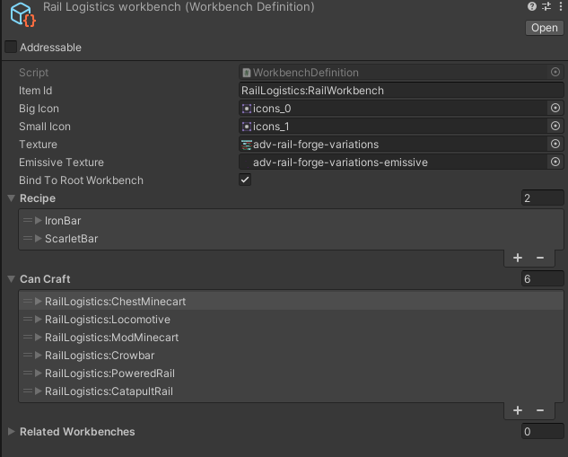

# Entity Module
Entity Module is a CoreLib submodule that helps adding specific entities. With mod SDK it's already possible to add custom entities, so this submodule is mostly a helper module.

## Usage example:
Make sure to call `CoreLibMod.LoadModules(typeof(EntityModule));` to in your mod `EarlyInit()` function, before using the module. This will load the submodule.

### Adding mod workbenches

To allow player to obtain your custom items you will need to either add it to a mob drop loot pool, or use custom workbenches.

To define a workbench, open create dialog and pick `CoreLib/New WorkbenchDefinition`. In this definition asset you are able to specify all needed properties:

<br>

- `Big Icon` and `Small Icon` are the same as usual item icons.
- `Texture` and `Emissive Texture` (Optional) need to be 16x80 px in size and contain the workbench sprites in all orientations:

<br>

Once you are done configuring this asset, in your mod `ModObjectLoaded(Object obj)` method add following code:

```cs
if (obj is WorkbenchDefinition workbenchDefinition)
{
    EntityModule.AddModWorkbench(workbenchDefinition);
    return;
}
```

### Modifying existing entities
You can modify existing entities (Including ones added by other mods) using a simple API.

Create a static class with method like so:
(This example adds an item to player crafting inventory)
```csharp
[EntityModification]
public static class MyModifications
{
    [EntityModification(ObjectID.Player)]
    private static void EditPlayer(Entity entity, GameObject authoring, EntityManager entityManager)
    {
        var itemId = API.Authoring.GetObjectID("MyMod:CoolItem");
    
        var canCraftBuffer = entityManager.GetBuffer<CanCraftObjectsBuffer>(entity);
    
        canCraftBuffer.Add(new CanCraftObjectsBuffer
        {
            objectID = itemId,
            amount = 1,
            entityAmountToConsume = 0
        });
    }
}
```
You will need to explicitly define what entity you want to target. This can be either a ObjectID for a vanilla entity, or a string for modded entity. Your patch will get called ONLY for your specified entity.

If you want to target all entities, use `API.Authoring.OnObjectTypeAdded` callback instead

Your function arguments are:
- `entity` - Entity of the converted prefab entity
- `authoring` - Original authoring prefab
- `entityManager` - EntityManager to allow you to modify the entity

**NOTE 1**: modifying `authoring` here will not propagate any changes!

**NOTE 2**: please be aware that `authoring` object can contain either `EntityMonoBehaviourData` or `ObjectAuthoring` if you are targeting modded objects. You need to ensure you handle this correctly

To register this add this to your `EarlyInit()` method:

```csharp
// Register single type
EntityModule.RegisterEntityModifications(typeof(MyModifications));

// Register all modifications in mod (Class MUST have the EntityModification attribute)
var modInfo = GetModInfo(this);
EntityModule.RegisterEntityModifications(modInfo);
```

## Modifying prefabs
Modifying prefabs is not very different from modifying entities.

Create a static class with method like so:
```csharp
[PrefabModification]
public static class MyModifications
{
    [PrefabModification(typeof(Chest))]
    private static void EditChest(MonoBehaviour entityMono)
    {
        Chest chest = entityMono.Cast<Chest>();
        // You are allowed to modify the prefab here in any way.
    }
}
```
You will need to explicitly define what prefab type you want to target. Your patch will get called ONLY for your specified type.

To register this add this to your `EarlyInit()` method:

```csharp
// Register single type
EntityModule.RegisterPrefabModifications(typeof(MyModifications));

// Register all modifications in mod (Class MUST have the PrefabModification attribute)
var modInfo = GetModInfo(this);
EntityModule.RegisterPrefabModifications(modInfo);
```