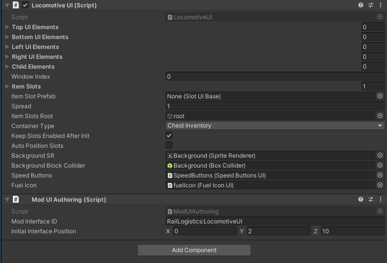
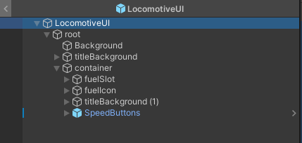

# User Interface Module
User Interface Module is a CoreLib submodule that allows to create modded user interfaces. The primary use case is custom UI for custom objects, but can be used to other purposes.

## Pre-release module note
This module is in pre-release stage, and the API might change in non backwards compatible way or be extended if this is necessary.

Use the module at your own risk.

## Usage example:
Make sure to call `CoreLibMod.LoadModules(typeof(UserInterfaceModule));` to in your mod `EarlyInit()` function, before using the module. This will load the submodule.

### Create prefab

Create a new prefab, with a `IModUI` deriving mono behaviour class on the root, together with a `ModUIAuthoring` component.

<br>

Ensure you have specified `Mod Interface ID` in `ModUIAuthoring`, as that will be your UI ID.

Your UI mono behaviour can derive either from `UIelement` for basic UI's or from `ItemSlotsUIContainer` if your inventory has slots. For examples inspect vanilla interfaces (They can be found on the managers prefab under )

Then create a game object called `root`, and place all UI elements under it.

<br>

You can use a component called `PixelSnap` to ensure your UI elements have been snapped to pixel grid to prevent rendering artifacts. In general remember that your UI sprites should be using Pixels Per Unit of 16 and be snapped to 1/16 grid.

### Register the prefab

Now in your mod `ModObjectLoaded(Object obj)` method write:
```cs
if (obj is not GameObject gameObject) return;
UserInterfaceModule.RegisterModUI(gameObject);
```

### Opening the UI

To open the UI use methods conveniently provided by the module class:

From a EntityMonoBehaviour deriving class:

```cs
// This method must be set in the InteractableObject component
public void OnUse()
{
    // I recommend to make a constant for the ID value
    ModUIManager.OpenModUI(this, "MyMod:AmazingUI");
}
```

With a Entity reference:

Note that `GetInteractionMonoBehaviour()` module method will not be available when opening the UI this way.
```cs
ModUIManager.OpenModUI(myEntity, "MyMod:AmazingUI");
```

From anywhere:

Note that `GetInteractionEntity()` and `GetInteractionMonoBehaviour()` module methods will not be available when opening the UI this way.
```cs
ModUIManager.OpenModUI("MyMod:AmazingUI");
```