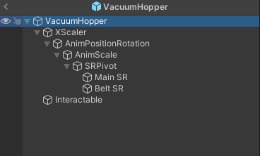
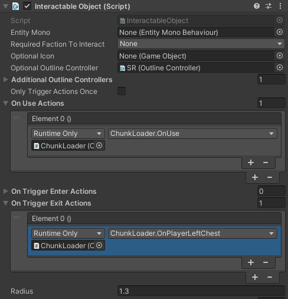
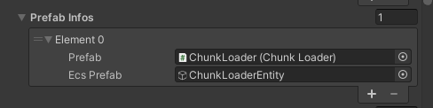

# Making entities with custom visuals
Entities such as blocks, enemies, projectiles, etc need a visual part to function. This guide explains how to do so on a example of a block. Process is similar for other kinds of entities

Main difference between an item and a block in Core Keeper is the custom visual prefab. This prefab is what you see in the world. You must create and assign it, for entity to be spawnable and placeable.

## How to make visual prefab
Visual prefab needs to contain a few things:
- A UNIQUE component class deriving EntityMonoBehavior
- All sprites to be drawn
- Interaction logic handler (Optional)

### EntityMonoBehavior derived class

Your component MUST derive from `EntityMonoBehavior`.

Your component is responsible <b>ONLY</b> for visuals. All of it's code runs <b>CLIENT</b> side. What this means is that the moment the player does not see your object on screen, your mono behavior code <b>WILL NOT</b> run.

Basic block class looks like so:
```cs
public class MyCustomBlock : EntityMonoBehavior
{
	// You can make custom methods that are called from Unity. This method, if setup correctly would be called, when user uses your block
    public void OnUse()
    {

    }
}
```

### Creating prefab
Typical prefab structure look like this. You can find how something is done by checking vanilla prefabs.

<br>

On the root, there must be a EntityMonoBehavior deriving component.

After setting up the prefab make sure that every Sprite Renderer has a `RuntimeMaterial` component on them, with material name set. This will ensure that sprite materials will get replaced by real materials correctly.

Also if your block needs to be interacted with, ensure correct setup of Interactable component:

<br>

## Adding custom block
After creating your prefab, you need to hook it into `Prefab` property on `EntityMonoBehaviorData` and add the entity as usual.

<br>
