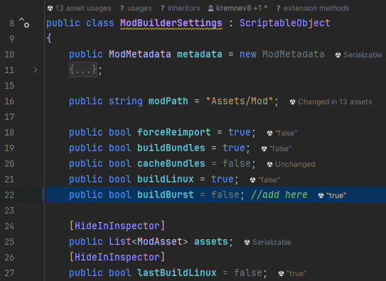

# How To Build Burst Files
Go To: `Assets/ModSDK/SDK/Editor/ModBuilderSettings.cs`

Add this line of code to line 22 just after the field `buildLinux`:
```c#
public bool buildBurst = false;
```
It should look like this after editing:




## Done
Now you're good to go if you need to build the burst files for your mod. 
Make sure the box is checked to `true`; then,
install your mod like usual via the `Mod SDK Window` and the burst files will be added in automatically.