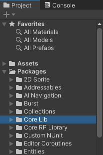
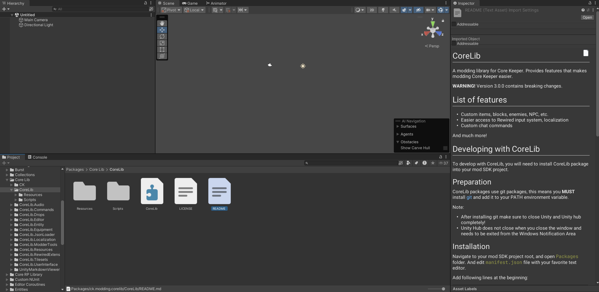
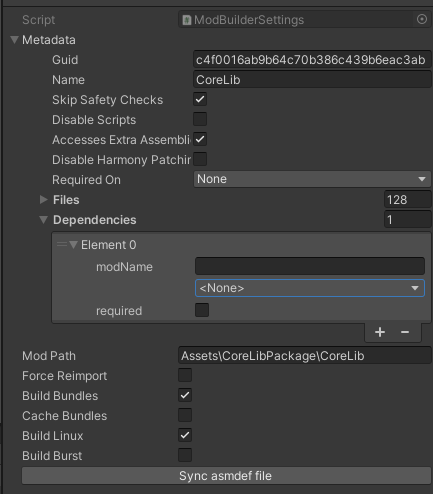
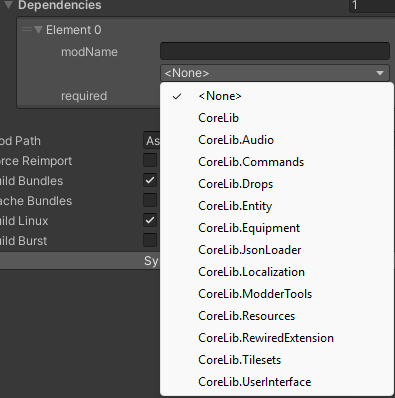

# CoreLib
A modding library for Core Keeper. Provides features that makes modding Core Keeper easier.

**WARNING!** Version 3.0.0 contains breaking changes.

## List of features
- Custom items, blocks, enemies, NPC, etc.
- Easier access to Rewired input system, localization
- Custom chat commands

And much more!

## Developing with CoreLib
To develop with CoreLib, you will need to install the CoreLib package into your mod SDK project.

### Preparation
CoreLib packages use git packages, this means you **MUST** install [git](https://git-scm.com/download/win) and add it to your PATH environment variable.  

Note:
- After installing git make sure to close Unity and Unity Hub ***COMPLETELY!***
- Unity Hub does not close when you close the window and needs to be exited from the Windows Notification Area

### Installation
Navigate to your mod SDK project root, and open the `Packages` folder. Edit the `manifest.json` file with your favorite text editor. 

Add following line at the beginning to your dependencies:
```
"ck.modding.corelib": "https://github.com/CoreKeeperMods/CoreLib.git?path=/Assets/CoreLibPackage#main",
```
It will look like this after adding it:
```json
{
  "dependencies": {
    "ck.modding.corelib": "https://github.com/CoreKeeperMods/CoreLib.git?path=/Assets/CoreLibPackage#main",
    //the rest of your package dependencies
  }
}
```
If you want to install latest version of CoreLib use `#main` at the end. However; it is highly recommended that you lock your version, and update it manually. To do that replace `#main` with `#tag`. For example `#3.6.4`.
```
"ck.modding.corelib": "https://github.com/CoreKeeperMods/CoreLib.git?path=/Assets/CoreLibPackage#3.6.4",
```
Please note that the CoreLibPackage version is separate from CoreLib submodules version on Mod IO. This is because this package combines all submodules and other tools. 

To find out the correct version to target read the release notes for the CoreLibPackage [here](https://github.com/CoreKeeperMods/CoreLib/releases).

### Done
Now you can open your project, and you will have Core Lib ready to be used.



You can access CoreLib documentation from within your editor, by navigating to CoreLib package folder and viewing `README.md`



## Utilities
The package `CoreLib.Editor` adds a few useful additions to the ModSDK:

- Select dependencies from a dropdown (Including CoreLib)
- Updating asmdef file accordingly to your dependency declaration (Button labeled `sync asmdef file`)
- Building Burst assembly with your mod (Requires updating ModSDK files [How To Build Burst Files](./HowToBuildBurst.md))




###### **NOTE:** Any additional features require manual changes to mod SDK project. Reference [Limoka's Fork](https://github.com/limoka/CoreKeeperModSDK) of mod SDK project to see what changes you may need.
***CAUTION: Fork is out-of-date and may no longer be necessary***.

## Documentation
Each submodule contains a markdown file with documentation.

Contents:
- [Audio Submodule](../CoreLib.Audio/README.md)
- [Commands Submodule](../CoreLib.Commands/README.md)
- [Drops Submodule](../CoreLib.Drops/README.md)
- [Entity Submodule](../CoreLib.Entity/README.md)
- [Equipment Submodule](../CoreLib.Equipment/README.md)
- [Localization Submodule](../CoreLib.Localization/README.md)
- [Resources Submodule](../CoreLib.Resources/README.md)
- [RewiredExtension Submodule](../CoreLib.RewiredExtension/README.md)
- [Tilesets Submodule](../CoreLib.Tilesets/README.md)
- [User Interface Submodule](../CoreLib.UserInterface/README.md)

# Mod.io Links
- [CoreLib](https://mod.io/g/corekeeper/m/core-lib)
- [Audio Submodule](https://mod.io/g/corekeeper/m/corelibaudio)
- [Commands Submodule](https://mod.io/g/corekeeper/m/corelibcommands)
- [Drops Submodule](https://mod.io/g/corekeeper/m/corelibdrops)
- [Entity Submodule](https://mod.io/g/corekeeper/m/corelibentity)
- [Equipment Submodule](https://mod.io/g/corekeeper/m/corelibequipment)
- [Localization Submodule](https://mod.io/g/corekeeper/m/coreliblocalization)
- [Resources Submodule](https://mod.io/g/corekeeper/m/corelibresources)
- [RewiredExtension Submodule](https://mod.io/g/corekeeper/m/corelibrewiredextension)
- [Tilesets Submodule](https://mod.io/g/corekeeper/m/corelibtilesets)
- [User Interface Submodule](https://mod.io/g/corekeeper/m/corelib-userinterface)