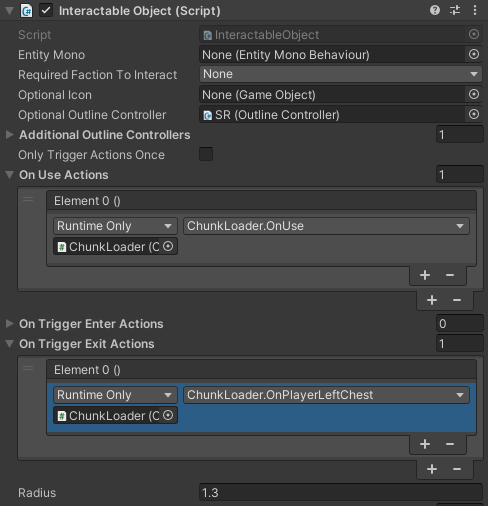

# Making custom blocks
Main difference between an item and a block in Core Keeper is the custom visual prefab. This prefab is what you see in the world. You must create and assign it, for entity to be spawnable and placeable.

## How to make visual prefab
Visual prefab needs to contain a few things:
- A UNIQUE component class deriving EntityMonoBehavior
- All sprites to be drawn
- Interaction logic handler

### EntityMonoBehavior derived class

Your component MUST derive from `EntityMonoBehavior`. Unfortunately deriving directly from causes issues. For this purpose special class `ModEntityMonoBehavior` was created, it handles all issues related to overriding game class.

Your component is responsible <b>ONLY</b> for visuals. All of it's code runs <b>CLIENT</b> side. What this means is that the moment the player does not see your object on screen, your mono behavior code <b>WILL NOT</b> run.

Basic block class looks like so:
```cs
public class MyCustomBlock : ModEntityMonoBehavior
{
    public MyCustomBlock(IntPtr ptr) : base(ptr) { }

    public override void OnOccupied()
    {
        // This is replacing base.OnOccupied(). This is needed due to internal implemenation of Il2CppInterop
        // I recommend always using it instead. There is a variation that allows to pass parameters too
        this.CallBase<EntityMonoBehaviour>(nameof(OnOccupied));
		// This method is called when your block visual gets loaded from pool
    }

	// You can make custom methods that are called from Unity. This method, if setup correctly would be called, when user uses your block
    public void OnUse()
    {

    }
}
```
Make sure to register your type with `ClassInjector.RegisterTypeInIl2Cpp<MyCustomBlock>();` call.

### Fields in EntityMonoBehavior

You are allowed to add custom fields. These are injected and serialized correctly.

To do this define the field like so:
```cs
public Il2CppReferenceField<MyType> myCustomField;
public Il2CppValueField<MyValueType> myValueTypeField;
```
Ensure that the type is from Il2Cpp. 

If type is stored in Unity hierarchy (Component, GameObject, etc) or it is value type you are good. However if it's not, <b> IT WILL GET COLLECTED</b>. 

To prevent this declare it like this instead:
```csharp
public Il2CppReferenceField<MyType> myCustomField;
private GCHandle myCustomFieldHandle;
```

And override `Allocate` and `OnDestroy` methods:
```csharp
public override bool Allocate()
{
    bool shouldAllocate = base.Allocate();
    if (shouldAllocate)
    {
        // This will prevent Garbage Collector from collecting your object
        myCustomFieldHandle = GCHandle.Alloc(myCustomField.Value);
    }
    return shouldAllocate;
}

public override void OnDestroy()
{
    base.OnDestroy();
    myCustomFieldHandle.Free();
}
```

### Creating prefab
The prefab structure is mostly standard, you can find how something is done by checking vanilla prefabs.

<br>

On the root, there must be a EntityMonoBehavior deriving component. To allow Unity to see your component, make a dummy script in Unity, that has the same name and namespace, but lacks any implementation. You can also keep fields, their serialization works as usual.

Example of such dummy:
```cs
public class MyCustomBlock : ModEntityMonoBehavior
{
    // In dummies custom fields are defined without `Il2CppReferenceField`
    public MyType myCustomField;

    // Override is removed, because access modifiers in Unity are different from ours
    public void OnOccupied()
    {
    }

    public void OnUse()
    {
    }
}
```

After setting up the prefab make sure that every Sprite Renderer has a `RuntimeMaterial` component on them, with material name set. This will ensure that sprite materials will get replaced by real materials correctly.

Also if your block needs to be interacted with, ensure correct setup of Interactable component:

<br>

## Adding custom block
After creating your prefab, you need to hook it into `Prefab` property on `EntityMonoBehaviorData` and add the entity as usual.

<br>
