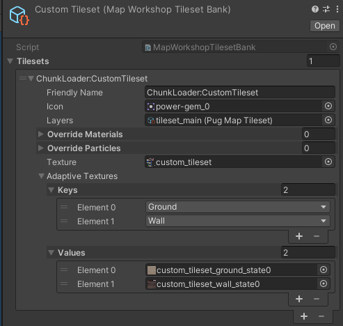
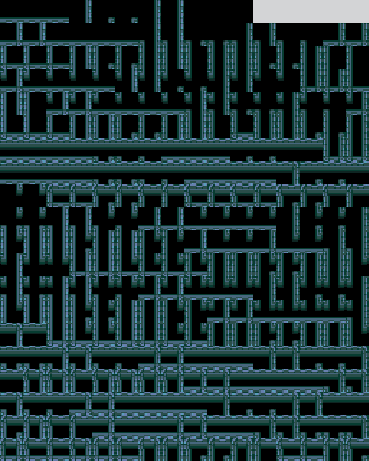

# Making custom items
If you don't know how to make a certain type of item, find it in the Unity Editor and copy the prefab. There you should see everything that makes it tick.

Properties of `EntityMonoBehaviourData` tha are relevant:

- `Initial Amount` - useful together with `DurabilityCDAuthoring` to define initial durability
- `Icon` and `Small Icon` - defines icon of your entity. This is mostly used for items. Small icon is often used when you hold your item in hand. Normal icon is shown in inventory and on pedestals.
- `Is Stackable` - defines if you can stack your item
- `Required Objects To Craft` allows you to define your item crafting recipe.


## Swords, Tools, etc
To make a equipable item with use animation you need to:
- Set the `ObjectType` to tool or weapon type
- Add `DurabilityCDAuthoring`, `GivesConditionsWhenEquipedCDAuthoring`, `CooldownCDAuthoring`, `WeaponDamageCDAuthoring` and `LevelCDAuthoring` component authorings and configure them correctly
- Assign both icons to first sprite in item animation sheet.

Example of the sprite sheet. It should be 120x120 px and have 7 sprites showing item in different states. You can find such sheets for all weapons and tools in the Unity Editor

<br>

### Ranged weapon 
To make a ranged weapon you mostly need to do the same as with any other weapon. Except for the fact that you will need a custom projectile entity added.
To hook modded projectile entity use `ModRangeWeaponCDAuthoring` component instead of `RangeWeaponCDAuthoring`

## Armor

To make armor you need to:
- Set the `ObjectType` to armor type
- Add `DurabilityCDAuthoring`, `ModEquipmentSkinCDAuthoring`, `GivesConditionsWhenEquipedCDAuthoring` and `LevelCDAuthoring` component authorings and configure them correctly

Make a armor spite sheet. Examples of such sheets can be found in the Unity Editor.
Now assign your texture to `ModEquipmentSkinCDAuthoring`. The component will automatically set everything up.

## Tile Item
Tile Items are items which when placed are changing tilemap, instead of being placed into the world. This applies to walls, floors, bridges, fences, etc. These items don't need a visual prefab to function. Instead they need a custom tileset.

To make custom tileset(s) create `MapWorkshopTilesetBank` asset in your Unity project.

<br>

Here you will need to assign `Friendly Name` and some textures. Name field is not a name, but your tileset ID, set it to a UNIQUE string. 

`texture` is first texture field. It contains a reference texture for tileset, and contains a variety of different things. Look at vanilla textures to figure out what is what.

`Adaptive Textures` dict contains set of adaptive textures. These are important, as they store variations of your tile as it contacts other tiles. Usually these textures are autogenerated (By devs of the game). Unfortunately right now we can't say exactly how. So you might need to reference some of existing ones to make yours.

<br>

After setting up the asset just register the tileset in your `Load()` method:
```csharp
EntityModule.AddCustomTileset("Assets/myamazingmod/Prefab/MyAmazingTileset");
```

Now you can just use `ModTileCDAuthoring` component to set the tileset and tile type in Editor.