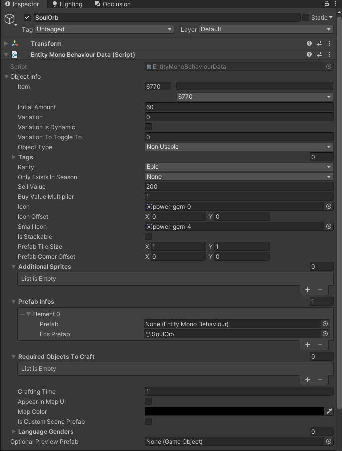

# Entity Module
Custom Entity Module is a submodule that allows to add new entities. This includes items, blocks, NPCs and other things. 

## Note on multiplayer and save compatibility
If you are playing with friends MAKE SURE to sync your `CoreLib.ModEntityID.cfg` and `CoreLib.TilesetID.cfg` config files. If anything inside does not match you WILL encounter issues connecting, missing items, and errors.

The same applies if you are loading a save of another user. If your ID's don't match the ID's save was created with, the save will load corrupted.

I recommend any mods adding custom content warn users about this on their page.

This might get improved later, but right now this is best that you can do.

## Usage example:
Make sure to add `[CoreLibSubmoduleDependency(nameof(EntityModule))]` to your plugin attributes. This will load the submodule.

Before continuing follow guide on [Resource Module](../ModResources/README.md) page to setup your asset bundle.

After setting up Unity project make sure to add the Editor Kit to your project. It contains dummies for all custom components amd some custom editors. You can find it [here](../../../EditorKit/)

### Making Entity Prefab
In your Unity Project make a new prefab (Or copy one of the original ones). It should contain only the root object with `EntityMonoBehaviorData` component attached. This looks like this:

<br>
In this component you can set all kind of properties that affect what the entity is. Most important properties are:

- `ObjectType` - defines what kind of entity is it. Here you can make it an item, block, enemy, etc
- `Icon` and `SmallIcon` - defines icon of your entity. This is mostly used for items. Small icon is often used when you hold your item in hand. Normal icon is shown in inventory and on pedestals.
- `PrefabInfos` here you need to have one entry with reference to prefab itself. The `Prefab` field allows to define custom visual for entity. This is used to make blocks, enemies, etc. For items it needs to be null.

On your entity prefab you can attach other ECS components which alter entity behavior or properties. You can inspect vanilla entities to find out what components do what.

For more specific guides on different types of custom entities check [guides](Guides/) folder.

Once you are done setting up your prefab place it in a folder with the name of your mod and pack a asset bundle. Don't forget to add the prefab to the bundle.

### Adding entity

With entity prefab made adding it is really easy. In your plugin `Load()` method add this code:
```cs
// Register your prefab. Use a UNIQUE string id to identify your entity. I recommend to include your mod name in the ID.
ObjectID entityID = EntityModule.AddEntity($"{MODNAME}:MyAmazingEntity", "Assets/myamazingmod/Prefab/MyAmazingEntity");

// Add localization terms for your item
EntityModule.AddEntityLocalization(entityID,
    "My Amazing Item",
    "This amazing item will change the world!");
```

If your entity need to have multiple variations use this method. Include list of all needed entity prefabs. Their variation fields have to be set to correct variations:
```cs
ObjectID entityID = EntityModule.AddEntityWithVariations($"{MODNAME}:MyAmazingEntity", new[]
{
    "Assets/myamazingmod/Prefab/MyAmazingBackwardEntity",
    "Assets/myamazingmod/Prefab/MyAmazingForwardEntity",
    "Assets/myamazingmod/Prefab/MyAmazingLeftEntity",
    "Assets/myamazingmod/Prefab/MyAmazingRightEntity",
});
```

To allow player to obtain the added entity (if it's an item), you will need to either add it to a mob drop loot pool, or use custom workbenches:
```cs
// You only need to supply single texture, which was set multiple mode
// Also you can specify the recipe and even disable automatic addition to root mod workbenches
ObjectID workbench = EntityModule.AddModWorkbench($"{MODNAME}:MyWorkbench",
    "Assets/myamazingmodTextures/myworkbench-texture", 
    new List<CraftingData> {new CraftingData(ObjectID.ScarletBar, 4)});

// Now you can add up to 18 items to this workbench
EntityModule.AddWorkbenchItem(workbench, entityID);
```

You should cache or remember `entityID` variable. It's the ObjectID that the game uses to identify the entity.
If you ever need to get this ID you can use `EntityModule.GetObjectId(string itemID)` method to access it again.

Also please note that you can't hardcode this ID. It will change depending on user mods installed. It can also be changed by user themselves by editing `CoreLib.ModItemID.cfg` config file found in `config` folder.

## Modifying existing entities
You can modify existing entities (Including ones added by other mods) using a simple API.

Create a static class with method like so:
```csharp
[EntityModification]
public static class MyModifications
{
    [EntityModification(ObjectID.Player)]
    private static void EditPlayer(EntityMonoBehaviourData entity)
    {
        CraftingCDAuthoring craftingCdAuthoring = entity.GetComponent<CraftingCDAuthoring>();
        craftingCdAuthoring.canCraftObjects.Add(new CraftableObject() { objectID = rootWorkbenches.First(), amount = 1 });
    }
}
```
You will need to explicitly define what entity you want to target. This can be either a ObjectID for a vanilla entity, or a string for modded entity. Your patch will get called ONLY for your specified entity.

You can target ALL entities, but you should avoid doing so if possible.

To register this add this to your `Load()` method:

```csharp
// Register single type
EntityModule.RegisterModifications(typeof(MyModifications));

// Register all modifications in assembly (Class MUST have the EntityModification attribute)
EntityModule.RegisterModifications(Assembly.GetExecutingAssembly());
```

## Creating wrapper components
You can create wrapper components like `ModTileCDAuthoring`, that can be added to prefabs, and do custom things when loaded. Right now this provides mostly convenience to change ObjectID or another dynamic value after load.

To do that create a Component overriding `ModCDAuthoringBase` like this:

```csharp
public class MyComponentCDAuthoring : ModCDAuthoringBase
{
    public MyComponentCDAuthoring(System.IntPtr ptr) : base(ptr) { }

    public override bool Apply(EntityMonoBehaviourData data)
    {
		// Do your work here
		// Make sure to destroy this before exiting if this is intended for entity prefab
		
        return true;
    }
}
```
You will get two overridable methods `Allocate()` and `Apply()`. 

Allocate works the same way as on `ModEntityMonoBehavior` and allows you to ensure survival of your custom fields.

Apply is the important method here. It is called before the prefab is added. So you can do slight tweaks here. 

Wrapper components can be added to both entity prefab and visual prefab. When added to entity prefab you WILL need to destoy it after finishing your stuff in `Apply()`. This is due to the fact ECS expects every component to be convertable to ECS component. Which your component is not.

From here make sure to register the component in Il2Cpp domain, and make a dummy for your component in Unity.

## Creating custom ECS components

Creating custom ECS components is not much different from creating wrapper components. Custom ECS components need two things: 
- ECS component struct - this will be holding your data
- component authoring - this will perform `conversion` from authoring world to game world.

<details><summary>Example</summary>

```csharp
[Il2CppImplements(typeof(IComponentData))]
public struct MyECSComponentCD
{
    public int value;
    public int3 position;
}

[Il2CppImplements(typeof(IConvertGameObjectToEntity))]
public class MyECSComponentCDAuthoring : ModCDAuthoringBase
{
    public Il2CppValueField<int> value;
    public Il2CppValueField<int3> position;

    public MyECSComponentCDAuthoring(IntPtr ptr) : base(ptr) { }
    
    public void Convert(Entity entity, EntityManager dstManager, GameObjectConversionSystem conversionSystem)
    {
        dstManager.AddModComponentData(entity, new MyECSComponentCD()
        {
            value = value,
            position = position
        });
    }
}
```

</details>

When creating ECS component remember that components can only hold value types. That includes primitives such as `byte`, `int`, `float`, `char` and `bool` and any `blittable` structs that contain only other value types.

For example your ECS component **CAN'T** contain these types: `object`, `string`, `Type`, `GameObject`, `MonoBehavior`, etc. It also can't contain any `non blittable` structs which use these types.

However your authoring component **CAN** contain non value types, but you will need to perform some kind of conversion to value types. 