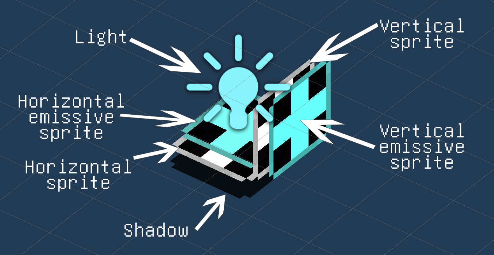

# JSON Loader Module

JSON loader module allows to create custom items using the power of JSON.

This is a prerelease version of JSON loader module, and it can be subject to change. Although item format is unlikely to change.

## Usage example

### With code

Make sure to add `[CoreLibSubmoduleDependency(nameof(JsonLoaderModule))]` to your plugin attributes. This will load the
submodule.

Then in your plugin `Load()` method write:

```csharp
string pluginfolder = Path.GetDirectoryName(Assembly.GetExecutingAssembly().Location);
JsonLoaderModule.LoadFolder(PluginInfo.PLUGIN_GUID, pluginfolder);
```

### Without code

Json Loader module can also be used without writing code at all. To do so use prebuilt
loader [assembly](../../../JsonModLoader/JsonModLoader/Binaries).

Create a new folder in the plugins folder, and move the loader assembly there. Make sure to include `manifest.json`
file, which must contain `author`, `name` and `version_number` properties. This is the same file used by Thunderstore.

### Uploading to Thunderstore
When uploading your mod to thunderstore create a folder `plugins` in which you must include the assembly, `resources` folder and `manifest.json`. 

Next to the `plugins` folder also include typical thunderstore files including a duplicate of the `manifest.json`.

## Creating items using JSON

To start creating items create a new folder named `resources` in your plugin folder. You can include here all textures
and item json files. You are allowed to create any subfolders, so it's recommended to structure your folder.

Each item is contained it its own json file. Here is an example of a simple item.

```json
{
  "$schema": "https://raw.githubusercontent.com/Jrprogrammer/CoreLib/master/CoreLib/Submodules/JsonLoader/Schemas/entity_schema.json",
  "type": "item",
  "itemId": "MyMod:MyItem",
  "icon": "icons/my-item-big-icon.png",
  "smallIcon": "icons/my-item-small-icon.png",
  "localizedName": "My Item",
  "localizedDescription": "This item was added using JSON!",
  "isStackable": true,
  "requiredObjectsToCraft": [
    {
      "objectID": "Wood",
      "amount": 6
    }
  ]
}
```

To be able to craft the item you also must add a mod workbench (Or write code that would make it obtainable):

```json
{
  "$schema": "https://raw.githubusercontent.com/Jrprogrammer/CoreLib/master/CoreLib/Submodules/JsonLoader/Schemas/entity_schema.json",
  "type": "modWorkbench",
  "itemId": "MyMod:MyWorkbench",
  "icon": "icons/wb-big-icon.png",
  "smallIcon": "icons/wb-small-icon.png",
  "localizedName": "Test Workbench",
  "localizedDescription": "This workbench was added using JSON!",
  "isStackable": true,
  "requiredObjectsToCraft": [
    {
      "objectID": "GoldBar",
      "amount": 6
    }
  ],
  "canCraft": [
    "MyMod:MyItem"
  ]
}
```

If your editor supports validating using JSON schemas, then you can add this line to your json files:

```
"$schema": "https://raw.githubusercontent.com/Jrprogrammer/CoreLib/master/CoreLib/Submodules/JsonLoader/Schemas/entity_schema.json",
```

You might need to look at the game code to determine what fields you need to set, and what values exist. To do so you
can use basic dnSpy [project](https://core-keeper-modding.gitbook.io/modding-wiki/modding/view-source-code#using-cpp2il)

### Sprites

The paths to the icons are relative to your `resources` folder. Sprites can be defined in two ways: `string`
and `object`. An example of the second:

```json
{
  "icon": {
    "path": "icons/icon.png",
    "type": "icon-top"
  }
}
```

Supported types include `icon-top` and `icon-bottom`, which allow to contain both small and big icons in one file. This
does imply your texture is `16x32` px.

You can also define the rect manually:

```json
{
  "icon": {
    "path": "icons/icon.png",
    "rect": {
      "x": 0,
      "y": 16,
      "width": 16,
      "height": 16
    }
  }
}
```

This would identical to `icon-top` icon type above.

### Components

Your JSON item can have ECS components attached to it. To do so use `components` property. Each object must contain
a `type` field, which must be a valid class name. This includes modded components too.
<details><summary>Melee Weapon Example</summary>

```json
{
  "$schema": "https://raw.githubusercontent.com/Jrprogrammer/CoreLib/master/CoreLib/Submodules/JsonLoader/Schemas/entity_schema.json",
  "type": "item",
  "itemId": "MyMod:TestMace",
  "icon": {
    "path": "icons/mace.png",
    "rect": {
      "x": 0,
      "y": 80,
      "width": 40,
      "height": 40
    }
  },
  "smallIcon": {
    "path": "icons/mace.png",
    "rect": {
      "x": 0,
      "y": 80,
      "width": 40,
      "height": 40
    }
  },
  "localizedName": "My Test Mace",
  "localizedDescription": "This item was added using JSON!",
  "craftingTime": 2.5,
  "initialAmount": 666,
  "objectType": "MeleeWeapon",
  "rarity": "Epic",
  "iconOffset": {
    "x": 0,
    "y": -0.125
  },
  "requiredObjectsToCraft": [
    {
      "objectID": "IronBar",
      "amount": 5
    },
    {
      "objectID": "MyMod:Iridium",
      "amount": 5
    }
  ],
  "components": [
    {
      "type": "DurabilityCDAuthoring",
      "maxDurability": 666,
      "repairMultiplier": 0.5,
      "reinforceCostMultiplier": 1
    },
    {
      "type": "GivesConditionsWhenEquippedCDAuthoring",
      "givesConditionsWhenEquipped": [
        {
          "id": "MovementSpeedDecrease",
          "valueMultiplier": 1,
          "value": -150
        },
        {
          "id": "MeleeDamageIncrease",
          "valueMultiplier": 1,
          "value": 400
        }
      ]
    },
    {
      "type": "CooldownCDAuthoring",
      "cooldown": 1.5
    },
    {
      "type": "WeaponDamageCDAuthoring",
      "damage": 250,
      "damageMultiplier": 1
    },
    {
      "type": "WeaponCDAuthoring",
      "baseHitColliderSize": 2,
      "extraHitColliderReachSize": 0
    }
  ]
}
```
This JSON file defines a melee mace weapon, that has certain effects.
Do note that the `mace.png` file contains a sprite as explained in the [item guide](../Entity/Guides/Items.md)

</details>

### Blocks and other entities
Although limited, custom blocks via JSON are now possible.

To make a custom block use `block` loader.

<details><summary>Custom block example</summary>
  
```json
{
	"$schema": "https://raw.githubusercontent.com/Jrprogrammer/CoreLib/master/CoreLib/Submodules/JsonLoader/Schemas/entity_schema.json",
	"type" : "block",
	"itemId" : "MyMod:MetalTable",
	"icon" : {
		"path": "icons/metal-table-icons.png",
		"type": "icon-top"
	},
	"smallIcon" : {
		"path": "icons/metal-table-icons.png",
		"type": "icon-bottom"
	},
	"localizedName" : "Metal Table",
	"localizedDescription" : "This table was added using JSON!",
	"isStackable" : true,
	"prefabTileSize" : [2, 2],
	"colliderSize" : [2, 1.65],
	"colliderCenter" : [0.5, 0.37],
	"components" : [
		{
			"type" : "CoreLib.Components.TemplateBlockCDAuthoring",
			"verticalSprite" : "icons/metal-table-bottom.png",
			"horizontalSprite" : "icons/metal-table-top.png",
			"shadowSprite" : "icons/metal-table-shadow.png",
			"verticalSpriteOffset" : [0, 0.343, 0],
			"horizontalSpriteOffset" : [0, 0.655, 0.75],
			"shadowOffset" : [0, 0.0625, 0.9],
			"prefabOffset"  : [0.5, 0, -0.3125],
			"interactHandler" : "MyMod.Blocks.MyInteractionHandler"
		}
	]
}
```

This example adds a 2x2 metal table which can be used. The sprites I used are included in [documentation folder](./documentation/blockExample)

To allow the usage you will need to write some code:
```cs
namespace MyMod.Blocks
{
    public class MyInteractionHandler : IInteractionHandler
    {
        public void OnInteraction(TemplateBlock block)
        {
            UnityEngine.Debug.Log("My block was used!");
        }
    }
}
```
In the `interactHandler` property put full name of the class. In this case it is `MyMod.Blocks.MyInteractionHandler`.
  
Do note that the class MUST be in your mod assembly. It won't work if it's somewhere else!
  
</details>

TemplateBlockCDAuthoring component has quite a few properties you can set:
- `verticalSprite` - Normal sprite facing side of the block
- `horizontalSprite` - Normal sprite facing top of the block
- `verticalEmissiveSprite` - Emissive sprite facing side of the block
- `horizontalEmissiveSprite` - Emissive sprite facing top of the block
- `shadowSprite` - Shadow sprite located under the block
- `lightColor` - Light color. Light is located at the center
- `verticalSpriteOffset` - Position offset for `verticalSprite` and `verticalEmissiveSprite`
- `horizontalSpriteOffset` - Position offset for `horizontalSprite` and `horizontalEmissiveSprite`
- `shadowOffset` - Position offset for `shadowSprite`
- `prefabOffset` - Whole prefab position offset
- `interactHandler` - Interaction handler full name. Use to allow custom behavior when interacted

Here you can see the prefab you are working with. The elements are moved further from where they are normally for demonstration purposes:
<br>

To fully setup your custom block you might need to set some values using UnityExplorer:
1. Open scene view
2. Select scene DontDestroyOnLoad
3. Select manager game object
4. Select Camera manager
5. Under it find OrigoTransform game object
6. Find game object named TemplateBlock (There might be a few)
7. Locate individual sprite rendereres and tweak their position to your liking.
8. Update values in JSON. local position Values you find in the inspector will be same as in JSON

